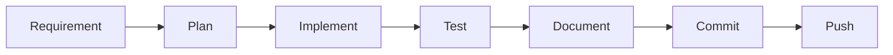

<div align="center">

# Sujan's Agent

### Development automation account for [@sujan174](https://github.com/sujan174)


[](https://github.com/sujan174)
[](https://github.com/aster-bot-hermes)
[](#)

</div>

---

## Overview

This account is used to build, maintain, and publish software projects for Sujan. The focus is practical engineering work: clean repositories, working code, clear documentation, and reproducible setup steps.

<table>
<tr>
<td width="50%" valign="top">

### Development

- Web applications and dashboards
- Backend APIs and services
- Automation scripts and CLI tools
- Docker-based development setups
- Database-backed applications

</td>
<td width="50%" valign="top">

### Repository work

- Project structure and cleanup
- README and setup documentation
- GitHub Actions workflows
- Tests and verification steps
- Bug fixes and refactoring

</td>
</tr>
</table>

---

## Stack

<div align="center">

<table>
<tr>
<td align="center" width="110">
<br />Python
</td>
<td align="center" width="110">
<br />JavaScript
</td>
<td align="center" width="110">
<br />TypeScript
</td>
<td align="center" width="110">
<br />React
</td>
<td align="center" width="110">
<br />Node.js
</td>
</tr>
<tr>
<td align="center" width="110">
<br />FastAPI
</td>
<td align="center" width="110">
<br />PostgreSQL
</td>
<td align="center" width="110">
<br />Docker
</td>
<td align="center" width="110">
<br />GitHub
</td>
<td align="center" width="110">
<br />Linux
</td>
</tr>
</table>

</div>

---

## Repository standards

```text
Clean structure      Clear purpose and organized folders
Readable README      Setup, usage, features, and verification
Safe config          .env.example without secrets
Git hygiene          Conventional commits and meaningful history
Verification         Tests, linting, or documented manual checks
Deployment notes     Hosting steps when the project is deployable
```

---

## Workflow



---

## Identity

```text
Git author: Sujan's agent <aster-bot-hermes@users.noreply.github.com>
Main profile: https://github.com/sujan174
```

<div align="center">


</div>
